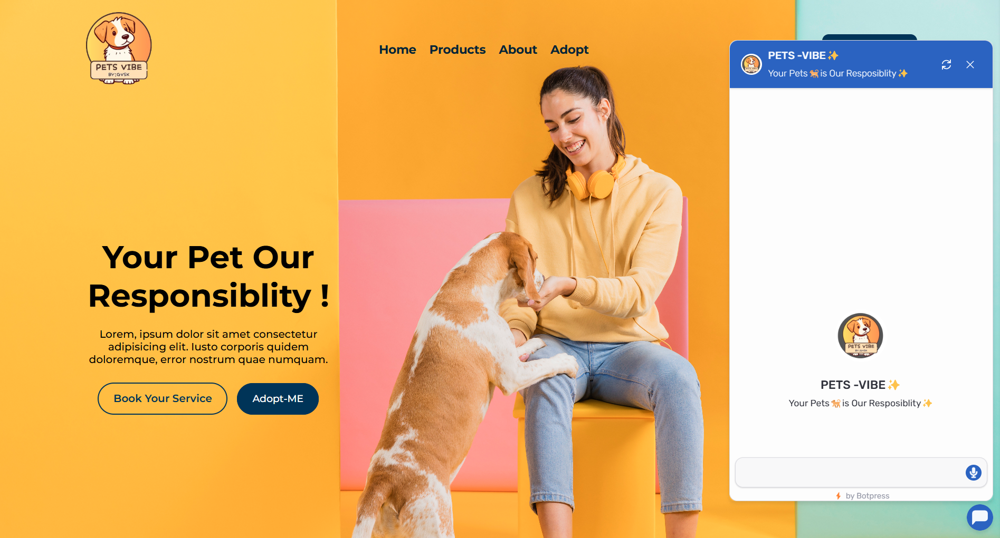
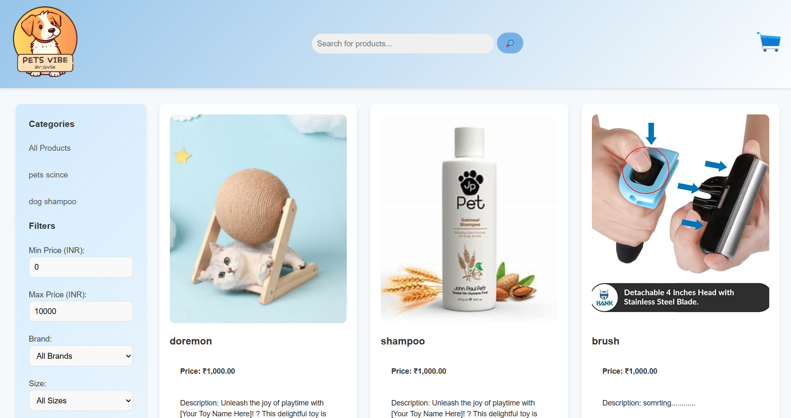
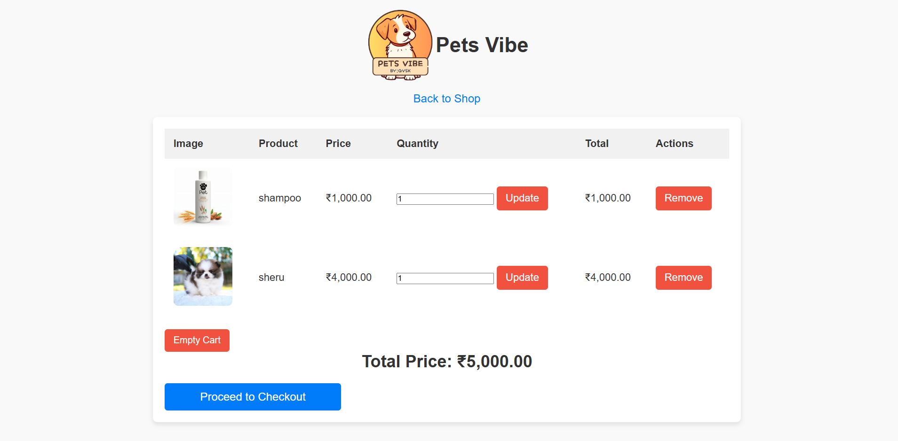
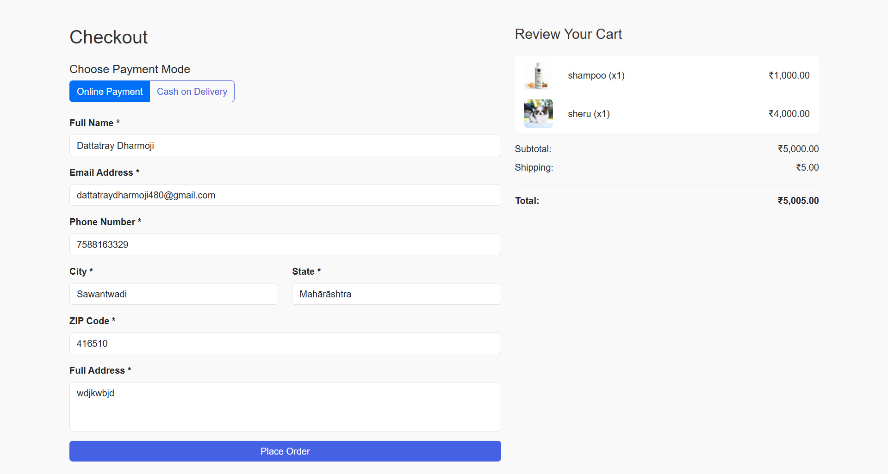
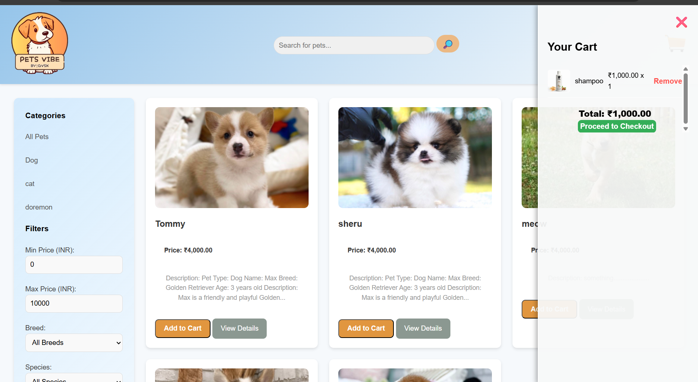
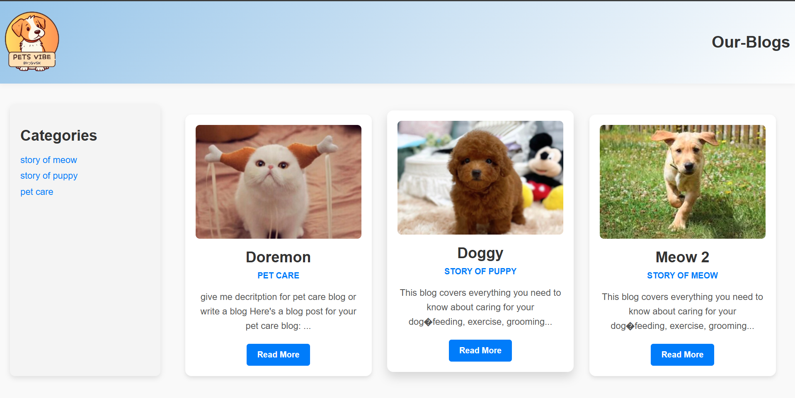
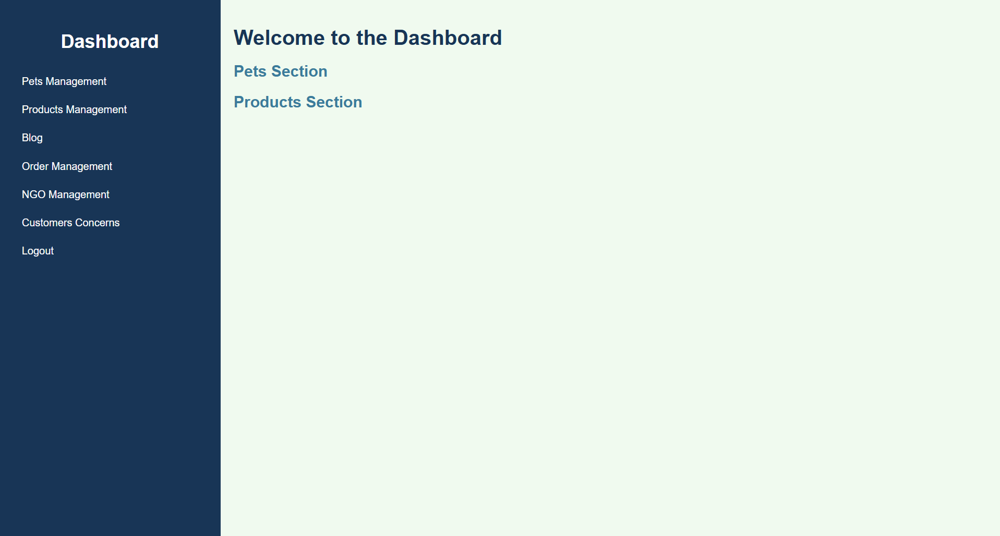
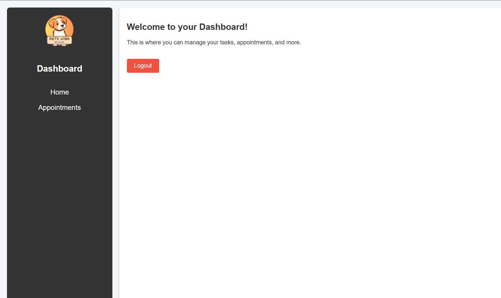
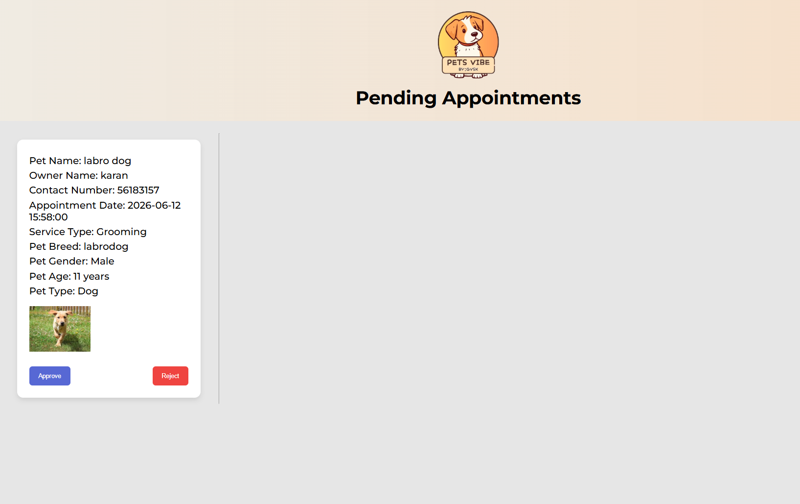
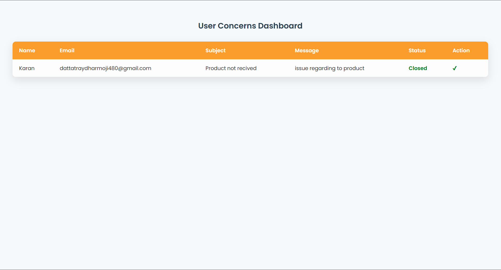

# PetsVibe - Pet Commerce Website

PetsVibe is a full-stack pet commerce website developed from scratch for pet lovers. The platform allows users to browse pet products, manage carts, place orders, and complete the checkout process through multiple payment options. The entire website is dynamic and fully managed through an Admin Panel, enabling efficient control over products, orders, and website content.

## Features

* User-friendly pet store interface
* Dynamic product listing and product details
* Shopping cart management
* Checkout and order placement
* Cash on Delivery (COD)
* Online payment workflow integration
* Session-based cart handling
* Order management system
* Responsive design for desktop and mobile devices
* Admin Panel for complete website management
* Product management (Add, Update, Delete products)
* Order tracking and management
* Dynamic content management through database integration

## Tech Stack

### Frontend

* HTML5
* CSS3
* Bootstrap 5
* JavaScript

### Backend

* PHP

### Database

* MySQL

## Project Modules

### User Side

* Home Page
* Product Catalog
* Product Details
* Shopping Cart
* Checkout System
* Payment Processing
* Order Management
* User Session Management

### Admin Panel

* Dashboard
* Product Management
* Order Management
* Website Content Management
* Customer Order Monitoring

## Installation

1. Clone the repository

```bash
git clone https://github.com/Dattatray-Dharmoji/Petsvibe_Website.git
```

2. Import the database file into MySQL

3. Configure database connection settings

4. Place the project inside your web server directory

5. Start Apache and MySQL

6. Open the project in your browser


## Screenshots

### Home Page



### Product Catalog



### Shopping Cart



### Checkout Page



### Pet Adoption Section



### Blogs Section



### Inventory Management


### Admin Dashboard



### Doctor Administration



### Doctor Appointment Management



### Customer Concerns Management




## Author

Dattatray Dharmoji

Portfolio:
https://dattatraydharmoji.infinityfreeapp.com/

LeetCode:
https://leetcode.com/u/Dattatray_Dharmoji/

GitHub:
https://github.com/Dattatray-Dharmoji
